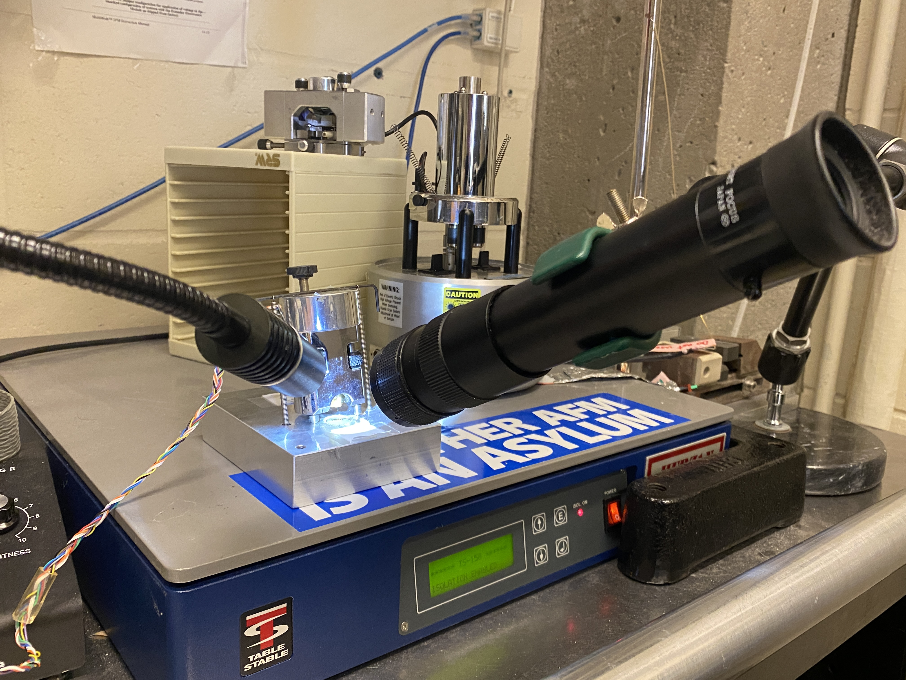

# Scanning Probe Microscopy Instrumentation

I had the privilege of working with the Grutter Group in the summer of 2023, and I worked with various aspects of instrumentation in scanning tunneling microscopes. While there, I was able to attend weekly meetings to learn about new developments in scanning probe microscopy and learn techniques in nanoscience, mechanical design, and circuitry. Now, I am interested in pursuing new projects in this field, which has already offered me so many chances to grow as a researcher. 

For this project, the aim was to work with a scanning tunneling microscope that would, if proven functional, be used in an ultra-high vacuum glovebox environment to characterize samples in atomic scales. I managed to fully characterize the instrument and its control system, and demonstrate that, due to a fault in the trimpot, it could not be used as it required further work and repairs. This taught me valuable lessons as a researcher as it allowed me to further develop my background in data analysis by now exploring techniques in instrumentation and hardware.

Attached below is some of the pictures I took of the microscope while I examined its behaviour:

